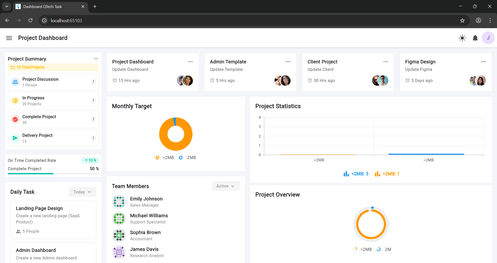
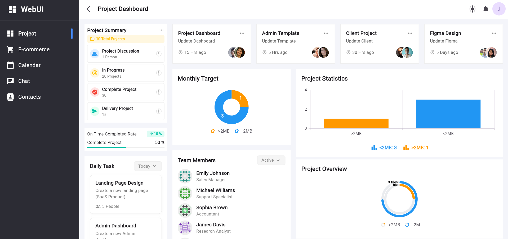
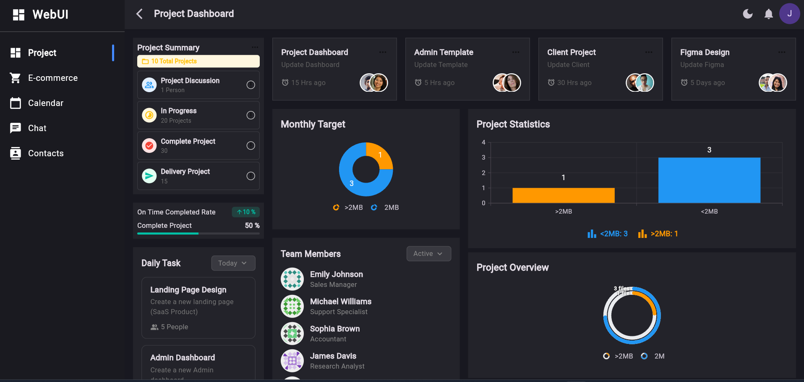
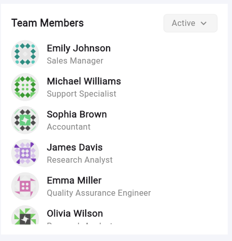

# Dashboard QTech Task



## 🚀 Overview

This is a professional, production-ready dashboard application built with **Flutter** using:
- **Clean Architecture**
- **BLoC pattern**
- **GetIt** for dependency injection
- **Firebase** for backend (files)
- **Dio** for REST API (team members)
- **Hive** for offline caching
- **Syncfusion** for charts

The app is fully **responsive** and works seamlessly on **web** and **mobile**.

---

## ✨ Features

- **Dashboard with analytics and charts**
- **Team Members** section (API + offline cache)
- **File management** (upload, download, delete, drag-and-drop)
- **Real-time updates** (Firebase)
- **Offline support** (Hive, connectivity_plus)
- **Shimmer loaders** for loading states
- **Responsive UI** for web and mobile
- **Dark/light theme toggle**
- **Dependency injection** with GetIt & Injectable
- **Clean, maintainable codebase**

---

## 🏗️ Architecture

### Clean Architecture

- **Presentation:** UI, widgets, BLoC/Cubit
- **Domain:** Entities, repositories, use cases
- **Data:** Models, data sources (remote/local), repository implementations
- **Core:** Shared utilities, DioHelper, error handling

### State Management

- **BLoC/Cubit** for all business logic and state
- **No business logic in UI**
- **All dependencies injected via GetIt**

### Dependency Injection

- **GetIt** + **Injectable** for singleton and factory registration
- **No BlocProvider in main.dart**; all BLoCs/Cubits are injected

---

## 🌐 API & Data

### Team Members

- **Source:** [dummyjson.com/users](https://dummyjson.com/users)
- **Fields:** Only required fields (firstName, lastName, image, company.title)
- **Pagination:** Supported via `limit` and `skip`
- **Caching:** Results cached in Hive for offline use

### Files

- **Backend:** Firebase Realtime Database
- **Features:** Upload, download, delete, drag-and-drop
- **Offline:** Files cached in Hive, UI shows banner when offline

---

## 📱 Responsive Design

- **Web:** Full dashboard layout, sidebar, charts, drag-and-drop
- **Mobile:** Stacked widgets, horizontal scroll for cards, mobile drawer sidebar
- **Consistent experience** across all devices


---

## 🛠️ Setup & Installation

1. **Clone the repo:**
   ```sh
   git clone https://github.com/yourusername/dashboard_qtech_task.git
   cd dashboard_qtech_task
   ```

2. **Install dependencies:**
   ```sh
   flutter pub get
   ```

3. **Generate code (Hive, Injectable):**
   ```sh
   flutter pub run build_runner build --delete-conflicting-outputs
   ```

4. **Run the app:**
   ```sh
   flutter run -d chrome   # For web
   flutter run -d android  # For Android
   flutter run -d ios      # For iOS
   ```

5. **Firebase setup:**
   - Add your `google-services.json` and `GoogleService-Info.plist` as needed.

---

## 📂 Folder Structure

```
lib/
  core/                # Shared utilities (DioHelper, errors, etc.)
  features/
    dashboard/         # Dashboard feature (presentation, widgets, cubits)
    files/             # File management (bloc, data, domain)
    team_members/      # Team members (bloc, data, domain)
  injection_container.dart
  main.dart
```

---

## 🖼️ Screenshots

### Web
<p float="left">
  
  
</p>

### Mobile
<p float="left">
  
  
</p>

### Team Members


---

## 🧑‍💻 Contributing

Contributions are welcome! Please open issues or submit pull requests for improvements.

---

## 📄 License

This project is licensed under the MIT License.

---

## 📬 Contact

For questions or support, contact [your.email@example.com](mailto:your.email@example.com).

---

## 🙏 Acknowledgements

- [Syncfusion Flutter Charts](https://pub.dev/packages/syncfusion_flutter_charts)
- [Hive](https://pub.dev/packages/hive)
- [Dio](https://pub.dev/packages/dio)
- [Firebase](https://firebase.google.com/)
- [dummyjson.com](https://dummyjson.com/)

---
